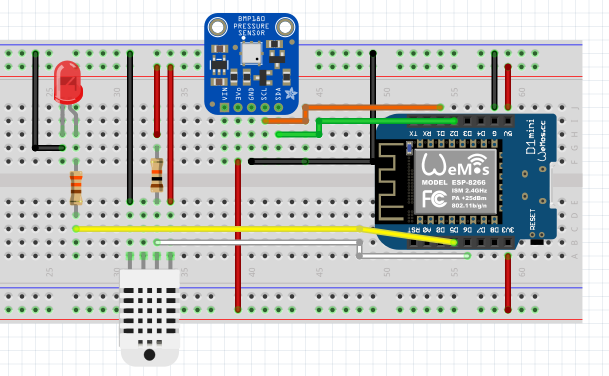

### Barometric pressure and humidity

## Background

Barometric pressure and humidity meter was the first connected device that I build many years ago. It was based on the original Raspberry Pi and it worked quite well. We had plenty of power cuts during the winters so being a Linux based setup the SD card was regularly corrupted. At least once a year I had to replace the SD card in the RasPi and install the operating system again. I [automated the process with Ansible](https://github.com/satuomainen/vadelma) after one or two manual iterations but it was still not very nice.

Then came along the ESP8266 and I made a simple thermometer (wifitemp in this repo) just to try it out. Working with the original ESP8266 was still quite complicated with many different tools. But the end product has been remarkably reliable and robust compared to the Raspberry Pi based device, there has been absolutely no need to fix the thermometer since it was put in place. For a couple of years I thought about building the barometric pressure meter with the ESP8266 but I knew it was going to take more than a Sunday afternoon so it got postponed for a long time.

Finally I ordered these amazing Wemos D1 Mini ES8266 boards in order to build some new things over the holidays. They are great! Just plug in a USB cable and write the code with Arduino IDE. All the dependencies could be added with the Library Manager in Arduino IDE. And uploading the software to the device was super simple, no more switches to flip and different tools to be used. How cool is that!?

## Components and wiring

To repeat the experiment, you need

* 1 x Wemos D1 Mini ESP8266 dev board
* 1 x BMP180 barometric pressure sensor
* 1 x AM2302 (DHT22) humidity sensor
* 1 x 10kΩ resistor
* Some veroboard, wires, enclosure
* 5V USB charger

There are plenty of wiring instructions in the Internet but this is how I did it:

## The software part

In the Arduino IDE, add support for the Wemos D1 Mini board. Open up Boards Manager and install `esp8266 by ESP8266 Community`.

In the Arduino IDE, install the following dependencies with the Library Manager

* Adafruit Unified Sensor
* Adafruit BMP085 Unified
* DHT Sensor Library

Copy `example.secrets.h` as `secrets.h` and put your Wifi AP name and password there. Also modify the endpoints where you want to send the reading data.

Open the `pressure_and_humidity.ino` in the Arduino IDE. Modify how the data is sent so that it matches whatever backend you are using.
